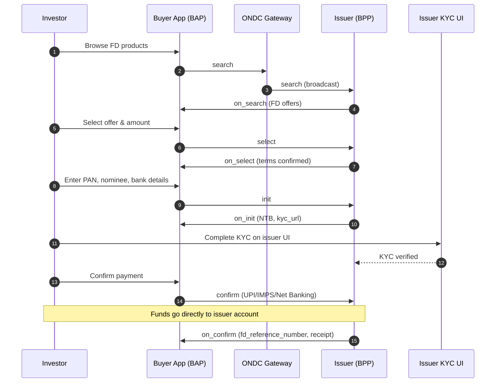
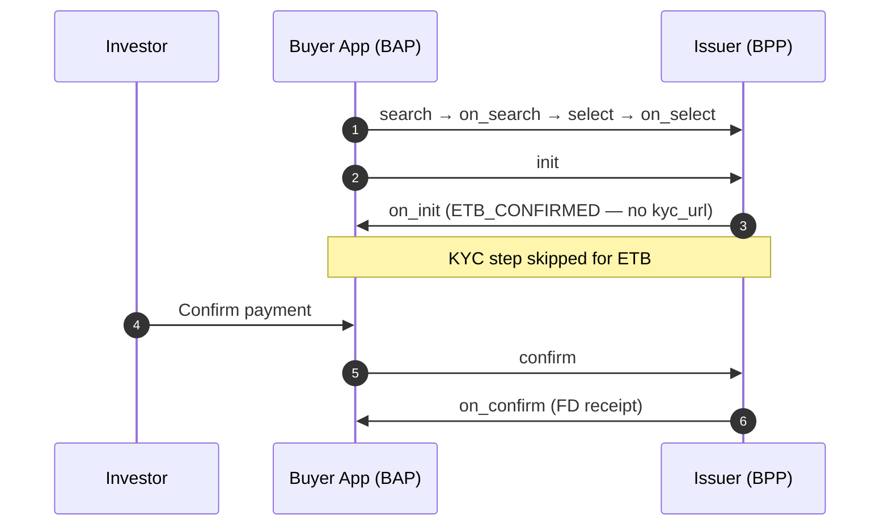
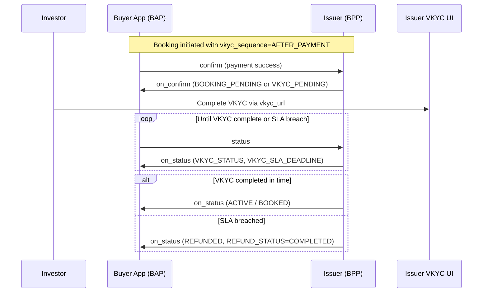
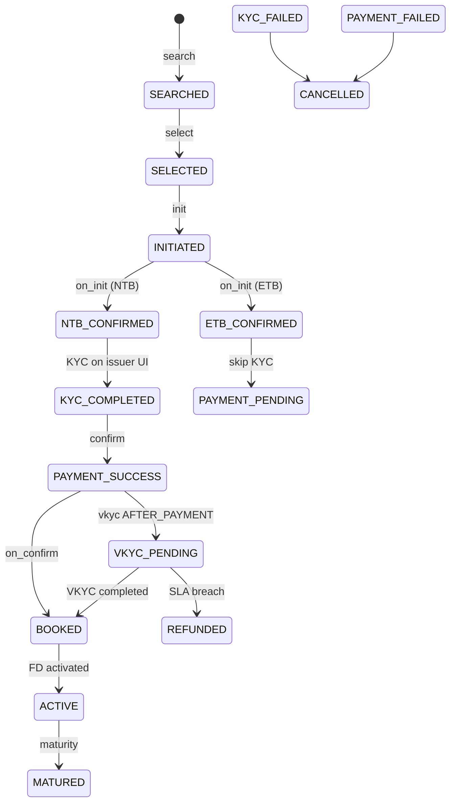

# ONDC Fixed Deposit Protocol — Specification Guide

**Document type:** Protocol specification for ONDC network submission  
**Domain code:** `ONDC:FIS:FD`  
**Protocol version:** 1.0.0  
**Beckn version:** 2.0.0  
**BRD reference:** Multiplus ONDC Fixed Deposit BRD v1.0 (06 July 2026)  
**Publisher:** Multiplus Finserv (TSP)  
**Specification status:** Complete (migration phase 7)

---

## Table of contents

1. [Executive summary](#1-executive-summary)
2. [Business context](#2-business-context)
3. [Network participants](#3-network-participants)
4. [Design principles](#4-design-principles)
5. [Specification repository layout](#5-specification-repository-layout)
6. [Beckn actions](#6-beckn-actions)
7. [End-to-end booking journey](#7-end-to-end-booking-journey)
8. [Existing-to-Bank (ETB) flow](#8-existing-to-bank-etb-flow)
9. [Video KYC after payment](#9-video-kyc-after-payment)
10. [Post-booking journeys](#10-post-booking-journeys)
11. [Transaction lifecycle and states](#11-transaction-lifecycle-and-states)
12. [Discovery model](#12-discovery-model)
13. [KYC, AML, and identity verification](#13-kyc-aml-and-identity-verification)
14. [Payment and fund flow](#14-payment-and-fund-flow)
15. [Issuer types and mandatory disclosures](#15-issuer-types-and-mandatory-disclosures)
16. [Error handling](#16-error-handling)
17. [BRD compliance and gap resolution](#17-brd-compliance-and-gap-resolution)
18. [Integration guide for network participants](#18-integration-guide-for-network-participants)
19. [Specification artifact index](#19-specification-artifact-index)
20. [Version scope and future releases](#20-version-scope-and-future-releases)

---

## 1. Executive summary

This document describes the **ONDC Fixed Deposit (FD) protocol** — an open-network specification that enables investors to discover, compare, book, and service Fixed Deposits from RBI-regulated issuers through any ONDC-enabled buyer application.

The protocol is built on the **Beckn open protocol** and follows the **ONDC Financial Services (FIS) component layout** used across official ONDC product specifications (attributes, flows, examples, error codes, enums, and tags under `api/components/`).

### What this protocol enables

| Capability | Description |
|------------|-------------|
| **Open discovery** | Broadcast `search` to all participating issuers via the ONDC Gateway |
| **Standardised comparison** | Uniform offer attributes — rate, tenure, payout mode, premature penalty, DICGC/credit rating |
| **Digital booking** | Full Beckn journey from selection through payment confirmation and FD receipt |
| **Issuer-owned compliance** | KYC/VKYC on the issuer interface; BAP orchestrates, BPP verifies |
| **Post-booking servicing** | Status query, withdrawal, interest certificates, Form 121, nominee updates, IGM |
| **Direct fund flow** | Investor funds transfer directly to the issuer; BAP and ONDC never hold customer money |

### v1 scope

- **Product:** Regular Fixed Deposits  
- **Investors:** Individual resident Indians only (`INDIVIDUAL_RESIDENT`)  
- **Issuers:** Scheduled Commercial Banks (SCB), Small Finance Banks (SFB), deposit-accepting NBFCs (NBFC-D)  
- **Payment modes:** UPI, IMPS, Net Banking  

---

## 2. Business context

Fixed Deposits remain a core savings product for Indian households. Today, distribution is largely confined to bank branches and closed aggregator platforms. Each integration is bilateral and non-interoperable.

The ONDC FD protocol standardises how:

1. **Buyer apps (BAPs)** expose FD products from multiple issuers through one integration.
2. **Seller apps / issuers (BPPs)** publish offers and accept bookings while retaining KYC, AML, and fund custody responsibilities.
3. **Investors** compare offers transparently and complete booking on a trusted buyer app, with compliance handled by the regulated issuer.

This specification implements the **Multiplus ONDC Fixed Deposit Business Requirements Document (BRD) v1.0** and resolves all items from the **14 July 2026 gap analysis**.

---

## 3. Network participants

| Role | Code | Responsibility |
|------|------|----------------|
| **Buyer App** | BAP | Investor-facing discovery, journey orchestration, payment initiation |
| **Seller App / Issuer** | BPP | RBI-regulated deposit-accepting entity — offer catalog, KYC/VKYC, booking, servicing |
| **ONDC Gateway** | — | Broadcasts `search` to all subscribed BPPs |
| **ONDC Registry** | — | Participant discovery and network policy |
| **Technology Service Provider** | TSP | Integration orchestration (Multiplus Finserv) |
| **Off-network services** | — | UIDAI, CKYC/CERSAI, payment gateway, issuer KYC/VKYC UI |

### Issuer eligibility (v1)

| Type | Code | DICGC insured | Credit rating disclosure |
|------|------|---------------|--------------------------|
| Scheduled Commercial Bank | SCB | Yes | Not required |
| Small Finance Bank | SFB | Yes | Not required |
| Deposit-accepting NBFC | NBFC-D | No | Mandatory on `on_search` |

---

## 4. Design principles

### 4.1 Direct fund flow

Investor payments are routed **directly to the issuer's designated account**. Neither the buyer app nor ONDC holds, pools, or routes customer funds. This is a non-negotiable design constraint documented in `api/components/docs/capabilities.json`.

### 4.2 Issuer-owned compliance

KYC and AML verification are performed on the **issuer's web or mobile interface** (`kyc_url`, `vkyc_url`). The BAP collects investor data in `init` but does not perform identity verification. Regulatory liability remains with the BPP.

### 4.3 Open discovery, BAP-side filtering

The `search` action broadcasts to all BPPs. Valid **network-level filters** are limited to `tenure_preference`, `senior_citizen`, and `interest`. Filtering by bank name or sorting by interest rate are **buyer-app display operations** applied after `on_search` returns.

### 4.4 Separation of specification layers

| Layer | Location | Purpose |
|-------|----------|---------|
| **Attributes** | `api/components/attributes/fixed-deposits/` | Field rules, mandatory/optional, Beckn paths, validation |
| **Flows** | `api/components/flows/fixed-deposits/` | Journey orchestration, step sequence, cross-references |
| **Examples** | `api/components/examples/fixed-deposits/` | Reference Beckn JSON payloads per action |
| **Error codes** | `api/components/error_codes/` | Domain error catalogue (823xxx range) |
| **Enums & tags** | `api/components/enums/`, `tags/` | Controlled vocabularies and tag groups |

---

## 5. Specification repository layout

The canonical entry point is **`index.json`** at the repository root.

```
ONDC/
├── index.json                          ← Root manifest (domain, version, all references)
├── PROTOCOL.md                         ← This document
├── README.md                           ← Quick reference
└── api/components/                     ← FIS-style specification pack
    ├── index.json                      ← Component registry
    ├── beckn-actions.json              ← Action catalogue with cross-links
    ├── attributes/fixed-deposits/      ← Per-action attribute definitions (16 actions)
    ├── flows/fixed-deposits/           ← Seven journey definitions
    ├── examples/fixed-deposits/        ← 23 reference Beckn payloads
    ├── error_codes/                    ← 27 error codes (823001–823027)
    ├── enums/fixed-deposits.json       ← Enumerated values
    ├── tags/fixed-deposits.json        ← Tag groups and codes
    └── docs/                           ← Capabilities, lifecycle, BRD compliance, validation rules
```

**Extension namespace:** `org.multiplus.ondc.fis.fd` v1.0

---

## 6. Beckn actions

The protocol defines **16 Beckn actions** across booking, post-booking servicing, and grievance handling.

### 6.1 Booking actions

| Action | Direction | Purpose |
|--------|-----------|---------|
| `search` | BAP → Gateway → BPP | Discovery broadcast |
| `on_search` | BPP → BAP | FD offer catalog |
| `select` | BAP → BPP | Offer selection with deposit amount and payout preferences |
| `on_select` | BPP → BAP | Selection confirmation with maturity estimates |
| `init` | BAP → BPP | Investor details, nominee, bank/UPI information |
| `on_init` | BPP → BAP | ETB/NTB determination, KYC/VKYC URLs, payment terms |
| `confirm` | BAP → BPP | Payment mode selection and booking confirmation |
| `on_confirm` | BPP → BAP | FD receipt with reference number and maturity schedule |

### 6.2 Post-booking actions

| Action | Direction | Purpose |
|--------|-----------|---------|
| `status` | BAP → BPP | Status query (FD lifecycle, VKYC progress) |
| `on_status` | BPP → BAP | Current status, VKYC SLA, refund state |
| `cancel` | BAP → BPP | Premature or partial withdrawal request |
| `on_cancel` | BPP → BAP | Withdrawal quote and settlement details |
| `support` | BAP → BPP | Document and servicing requests |
| `on_support` | BPP → BAP | Servicing response (certificates, portfolio, etc.) |

### 6.3 Grievance actions

| Action | Direction | Purpose |
|--------|-----------|---------|
| `issue` | BAP → BPP | IGM grievance initiation |
| `on_issue` | BPP → BAP | Grievance acknowledgment and resolution |

Full action registry: `api/components/beckn-actions.json`

---

## 7. End-to-end booking journey

### 7.1 New-to-Bank (NTB) — standard flow

Applies when the issuer does **not** recognise the investor from PAN lookup (`customer_type=NTB` in `on_init`). The investor completes full KYC on the issuer interface before payment.

**Flow definition:** `api/components/flows/fixed-deposits/new-booking-ntb.json`



#### Step-by-step (NTB)

| Step | API | Actor | Description | State after |
|------|-----|-------|-------------|-------------|
| 1 | `search` | BAP | Gateway broadcast; filters: tenure, senior citizen, interest only | SEARCHED |
| 2 | `on_search` | BPP | Issuer returns FD catalog with rate, tenure, min deposit, disclosures | — |
| 3 | `select` | BAP | Investor selects product, deposit amount, payout mode, maturity instruction | SELECTED |
| 4 | `on_select` | BPP | Confirms selection with maturity amount/date estimates | — |
| 5 | `init` | BAP | PAN, contact, address, bank/UPI, nominee or no-nominee declaration | INITIATED |
| 6 | `on_init` | BPP | PAN lookup → `customer_type=NTB`, mandatory `kyc_url` | NTB_CONFIRMED |
| 7 | *(off-network)* | Investor | Full KYC on issuer interface via `kyc_url` | KYC_COMPLETED |
| 8 | `confirm` | BAP | Payment mode selected; amount must match `select` | PAYMENT_SUCCESS |
| 9 | `on_confirm` | BPP | FD receipt — 10 mandatory attributes including `fd_reference_number` | BOOKED |

**Reference example:** `api/components/examples/fixed-deposits/on_confirm/on_confirm-fd-receipt.json`

---

## 8. Existing-to-Bank (ETB) flow

Applies when the issuer **recognises** the investor from PAN lookup (`customer_type=ETB`, `status=ETB_CONFIRMED` in `on_init`). KYC on issuer UI is **skipped**; the journey proceeds directly to payment.

**Flow definition:** `api/components/flows/fixed-deposits/new-booking-etb.json`



| Difference from NTB | ETB behaviour |
|---------------------|---------------|
| Step 7 (KYC UI) | **Skipped** |
| `on_init` response | `customer_type=ETB`, `status=ETB_CONFIRMED` |
| Typical use case | Repeat FD investment by existing bank customer |

---

## 9. Video KYC after payment

Some issuers configure VKYC to occur **after** payment (`vkyc_sequence=AFTER_PAYMENT`). In this case, the BAP polls `status` / `on_status` until VKYC completes or the SLA expires.

**Flow definition:** `api/components/flows/fixed-deposits/vkyc-post-payment.json`



| `on_init` fields | Purpose |
|------------------|---------|
| `vkyc_sequence` | `BEFORE_PAYMENT` or `AFTER_PAYMENT` |
| `vkyc_sla_hours` | Hours allowed for VKYC completion after payment |
| `vkyc_url` | Issuer VKYC interface URL |

On SLA breach, the BPP initiates refund to the investor's source account and returns `REFUNDED` status.

---

## 10. Post-booking journeys

After an FD is booked (`BOOKED` / `ACTIVE`), the following network journeys are supported.

### 10.1 Status query

| Action | Purpose |
|--------|---------|
| `status` / `on_status` | Poll FD lifecycle state, accrued interest, maturity date |

**Flow:** `api/components/flows/fixed-deposits/status-query.json`

### 10.2 Premature or partial withdrawal

| Action | Purpose |
|--------|---------|
| `cancel` / `on_cancel` | Request full or partial premature closure; receive penalty quote and settlement |

**Flow:** `api/components/flows/fixed-deposits/premature-withdrawal.json`

### 10.3 Document and servicing requests

Servicing is initiated via `support` with a `SERVICE_TYPE` tag:

| Service type | Description |
|--------------|-------------|
| `INTEREST_CERTIFICATE` | Annual interest certificate for tax filing |
| `FORM_121` | Tax exemption declaration (replaces Form 15G/15H from FY 2026-27) |
| `NOMINEE_UPDATE` | Post-booking nominee change |
| `MATURITY_INSTRUCTION_UPDATE` | Change auto-renewal or payout instruction |
| `PORTFOLIO_VIEW` | View active FD portfolio |
| `CLOSURE_CONFIRMATION` | Confirm funds credited on maturity or closure |

**Flow:** `api/components/flows/fixed-deposits/post-booking-servicing.json`

### 10.4 IGM grievance

| Action | Purpose |
|--------|---------|
| `issue` / `on_issue` | Raise and track investor grievances per ONDC IGM requirements |

**Flow:** `api/components/flows/fixed-deposits/igm-grievance.json`

---

## 11. Transaction lifecycle and states

The protocol defines a formal state machine for FD transactions. Full definition: `api/components/docs/lifecycle-and-states.json`.

### 11.1 Key states

| State | Meaning |
|-------|---------|
| `SEARCHED` | Discovery complete |
| `SELECTED` | Offer selected |
| `INITIATED` | Investor details submitted |
| `NTB_CONFIRMED` / `ETB_CONFIRMED` | Customer type determined |
| `KYC_PENDING` / `KYC_COMPLETED` / `KYC_FAILED` | KYC progress |
| `VKYC_PENDING` / `VKYC_COMPLETED` / `VKYC_FAILED` | Video KYC progress |
| `PAYMENT_PENDING` / `PAYMENT_SUCCESS` / `PAYMENT_FAILED` | Payment state |
| `BOOKING_PENDING` / `BOOKED` / `ACTIVE` | FD issuance |
| `MATURED` | FD reached maturity |
| `CANCELLED` / `REFUNDED` | Terminated or refunded |

### 11.2 State transition diagram (booking)



---

## 12. Discovery model

### 12.1 Network broadcast

```
BAP ──search──► ONDC Gateway ──search──► BPP₁, BPP₂, … BPPₙ
BPPᵢ ──on_search──► BAP (direct callback)
```

### 12.2 Valid search filters (network)

| Filter | Description |
|--------|-------------|
| `tenure_preference` | Desired FD tenure bucket |
| `senior_citizen` | Senior citizen rate eligibility |
| `interest` | Interest type preference |

### 12.3 BAP-side display filters (not sent on network)

- Issuer / bank name filter  
- Interest rate sorting  
- Any client-side ranking or comparison logic  

Attempting to use bank name or rate as network search filters returns error **823002**.

---

## 13. KYC, AML, and identity verification

| Aspect | Specification |
|--------|---------------|
| **Ownership** | BPP (issuer) |
| **Location** | Off-network issuer UI (`kyc_url`, `vkyc_url`) |
| **BAP role** | Collect data in `init`; redirect investor to issuer URL |
| **ETB/NTB branching** | Determined in `on_init` via PAN lookup against core banking |
| **VKYC sequencing** | Issuer-configurable: `BEFORE_PAYMENT` or `AFTER_PAYMENT` |
| **Investor type (v1)** | `INDIVIDUAL_RESIDENT` only — BAP must reject others before network call |

Off-network step in NTB flow (not a Beckn API call):

```
Investor → kyc_url (issuer web/app) → KYC_COMPLETED → BAP proceeds to confirm
```

---

## 14. Payment and fund flow

### 14.1 Payment modes (v1)

- UPI  
- IMPS  
- Net Banking  

Payment mode is selected in the **`confirm`** action, not in `select` or `init`.

### 14.2 Fund flow rules

```
Investor ──payment──► Issuer designated account
         (never via BAP or ONDC)
```

| Rule | Value |
|------|-------|
| Customer funds destination | Issuer designated account |
| BAP holds funds | No |
| ONDC holds funds | No |
| Amount validation | `confirm` amount must match `select` deposit_amount |

### 14.3 FD receipt

The **`on_confirm`** response is the **only** channel through which the BAP receives:

- `fd_reference_number`  
- Maturity date and amount  
- Interest rate and tenure confirmation  
- Receipt document URL (when provided)  

Ten mandatory receipt attributes are defined in `api/components/attributes/fixed-deposits/on_confirm.json`.

---

## 15. Issuer types and mandatory disclosures

### 15.1 SCB and SFB offers (`on_search`)

| Field | Requirement |
|-------|-------------|
| `DICGC_INSURED` | Mandatory disclosure |
| Credit rating fields | Not required |

### 15.2 NBFC-D offers (`on_search`)

| Field | Requirement |
|-------|-------------|
| `CREDIT_RATING_AGENCY` | Mandatory |
| `CREDIT_RATING` | Mandatory |
| `RATING_LAST_UPDATED` | Mandatory |
| `RISK_LEVEL` | Mandatory |

Missing NBFC credit rating on `on_search` returns error **823003**.

**Reference examples:**

- SCB: `api/components/examples/fixed-deposits/on_search/on_search-scb-offer.json`  
- NBFC-D: `api/components/examples/fixed-deposits/on_search/on_search-nbfc-offer.json`

---

## 16. Error handling

### 16.1 Error code range

| Range | Product | Status |
|-------|---------|--------|
| 822xxx | Mutual Funds (FIS14) | Official |
| **823xxx** | **Fixed Deposits (FIS FD)** | **Proposed — pending ONDC registry confirmation** |

Full catalogue: `api/components/error_codes/index.json` (27 codes across 9 categories).

### 16.2 NACK format

BPP returns a Beckn NACK with domain error in the callback:

```json
{
  "message": {
    "ack": { "status": "NACK" },
    "error": {
      "type": "DOMAIN-ERROR",
      "code": "823001",
      "message": "Investor not supported — v1 accepts INDIVIDUAL_RESIDENT only"
    }
  }
}
```

### 16.3 Error categories

| Category | Example codes | Typical trigger |
|----------|---------------|-----------------|
| `investor` | 823001 | Out-of-scope investor type |
| `discovery` | 823002, 823003 | Invalid search filter; missing NBFC rating |
| `validation` | 823013–823017 | Amount, tenure, nominee validation |
| `kyc` | 823007, 823019 | KYC failure, ETB lookup error |
| `payment` | 823004, 823009, 823024 | Payment mismatch, confirmation failure |
| `withdrawal` | 823011, 823012 | Premature withdrawal constraints |
| `servicing` | 823016, 823020 | Invalid service request |
| `technical` | 823025, 823026 | Timeout, internal error |

Each error code is cross-linked to validation rules and attribute files.

---

## 17. BRD compliance and gap resolution

All BRD v1.0 requirements and four gap-analysis items are implemented. Matrix: `api/components/docs/brd-compliance.json`.

### 17.1 Gap analysis resolution

| Gap | Topic | Resolution |
|-----|-------|------------|
| 1 | ETB / NTB branching | `on_init` returns `customer_type` (ETB/NTB) with conditional `kyc_url` |
| 2 | MVP investor eligibility | v1 limited to `INDIVIDUAL_RESIDENT`; enforced on BAP and BPP |
| 3 | NBFC-D credit rating | Conditional mandatory fields on `on_search` for NBFC-D issuers |
| 4 | Form 121 vs 15G/15H | `support` service type `FORM_121` with `FINANCIAL_YEAR` tag |

### 17.2 BRD requirement coverage (summary)

| Requirement | Beckn actions | Status |
|-------------|---------------|--------|
| Open discovery across issuers | search / on_search | Covered |
| Standardised offer attributes | on_search | Covered |
| Selection with amount and payout | select / on_select | Covered |
| KYC on issuer interface | on_init (kyc_url) | Covered |
| ETB repeat investment | new-booking-etb flow | Covered |
| Direct payment to issuer | confirm | Covered |
| VKYC post-payment with refund SLA | vkyc-post-payment flow | Covered |
| FD receipt on confirmation | on_confirm | Covered |
| Status and portfolio | status / support | Covered |
| Premature / partial withdrawal | cancel / on_cancel | Covered |
| Interest certificate & Form 121 | support / on_support | Covered |
| IGM grievance | issue / on_issue | Covered |

---

## 18. Integration guide for network participants

### 18.1 Buyer App (BAP) checklist

1. Register on ONDC FIS network with domain `ONDC:FIS:FD`.
2. Implement all 16 Beckn actions per `api/components/beckn-actions.json`.
3. Broadcast `search` via Gateway; apply display filters client-side only.
4. Reject out-of-scope investor types **before** initiating `init`.
5. Redirect investor to `kyc_url` / `vkyc_url` — do not perform KYC in-app.
6. Route payment directly to issuer account per `on_init` payment terms.
7. Store `fd_reference_number` from `on_confirm` — sole source of booking reference.
8. Poll `status` when `vkyc_sequence=AFTER_PAYMENT`.
9. Handle NACK responses using 823xxx error catalogue.

### 18.2 Seller App / Issuer (BPP) checklist

1. Subscribe to domain `ONDC:FIS:FD` on ONDC Registry.
2. Respond to Gateway-broadcast `search` with compliant `on_search` catalog.
3. Include DICGC disclosure (SCB/SFB) or credit rating (NBFC-D) on every offer.
4. Perform PAN lookup in `on_init`; return ETB or NTB with appropriate URLs.
5. Host KYC/VKYC on issuer interface; never delegate verification to BAP.
6. Accept payment only to issuer designated account.
7. Return complete FD receipt in `on_confirm` (all 10 mandatory attributes).
8. Support post-booking `status`, `cancel`, and `support` service types.
9. Implement refund workflow for VKYC SLA breach.

### 18.3 Recommended reading order for implementers

| Order | Artifact | Purpose |
|-------|----------|---------|
| 1 | `index.json` | Domain, version, manifest |
| 2 | `api/components/docs/capabilities.json` | Product scope and constraints |
| 3 | `api/components/flows/fixed-deposits/new-booking-ntb.json` | Primary booking journey |
| 4 | `api/components/examples/fixed-deposits/` | Payload shapes per action |
| 5 | `api/components/attributes/fixed-deposits/<action>.json` | Field-level rules |
| 6 | `api/components/error_codes/index.json` | Error handling |
| 7 | `api/components/docs/validation-rules.json` | Cross-field validation |

---

## 19. Specification artifact index

| Artifact | Path |
|----------|------|
| Root manifest | `index.json` |
| Component registry | `api/components/index.json` |
| Beckn action registry | `api/components/beckn-actions.json` |
| Attribute index | `api/components/attributes/fixed-deposits/index.json` |
| Per-action attributes | `api/components/attributes/fixed-deposits/<action>.json` |
| Shared context rules | `api/components/attributes/fixed-deposits/context.json` |
| Flow catalogue | `api/components/flows/index.json` |
| Example catalogue | `api/components/examples/fixed-deposits/index.json` |
| Error codes | `api/components/error_codes/index.json` |
| Enums | `api/components/enums/fixed-deposits.json` |
| Tags | `api/components/tags/fixed-deposits.json` |
| Capabilities | `api/components/docs/capabilities.json` |
| Lifecycle & states | `api/components/docs/lifecycle-and-states.json` |
| BRD compliance | `api/components/docs/brd-compliance.json` |
| Validation rules | `api/components/docs/validation-rules.json` |

### Flow catalogue

| Flow ID | Category | Steps | Description |
|---------|----------|-------|-------------|
| `new-booking-ntb` | Booking | 9 | Standard flow with issuer KYC |
| `new-booking-etb` | Booking | 8 | Abbreviated flow for existing customers |
| `vkyc-post-payment` | Compliance | 3 | VKYC polling and refund on SLA breach |
| `status-query` | Post-booking | 2 | FD status enquiry |
| `premature-withdrawal` | Post-booking | 2 | Full or partial premature closure |
| `post-booking-servicing` | Post-booking | 2 | Certificates, Form 121, nominee update |
| `igm-grievance` | Grievance | 2 | Investor grievance handling |

### Example catalogue (23 payloads)

Organised by Beckn action under `api/components/examples/fixed-deposits/<action>/`. Index: `api/components/examples/fixed-deposits/index.json`.

---

## 20. Version scope and future releases

### 20.1 v1.0.0 in scope

- Fixed Deposits from SCB, SFB, NBFC-D  
- Individual resident investors  
- UPI, IMPS, Net Banking  
- NTB and ETB booking paths  
- VKYC before or after payment  
- Post-booking status, withdrawal, servicing, IGM  

### 20.2 Planned for future versions

- Joint account holders  
- NRI (NRE/NRO) investors  
- Minors with guardian  
- HUF and corporate investors  
- Additional payment modes (as approved by ONDC)  

### 20.3 Open items for ONDC confirmation

| Item | Current specification | Pending |
|------|----------------------|---------|
| Domain code | `ONDC:FIS:FD` | ONDC official assignment |
| Error code range | 823001–823099 | ONDC registry allocation |
| Beckn version | 2.0.0 | Alignment with network policy |

---

## Document control

| Field | Value |
|-------|-------|
| **Specification version** | 1.0.0 |
| **Beckn version** | 2.0.0 |
| **BRD version** | 1.0 (06 Jul 2026) |
| **Gap analysis** | 14 Jul 2026 — all gaps resolved |
| **Publisher** | Multiplus Finserv |
| **TSP ID** | MULTIPLUS |
| **Specification format** | JSON (FIS component layout) |
| **Migration phase** | 7 (complete) |

---

*This document accompanies the machine-readable specification pack in this repository. For field-level definitions, refer to the attribute files under `api/components/attributes/fixed-deposits/`. For authoritative payload examples, refer to `api/components/examples/fixed-deposits/`.*
