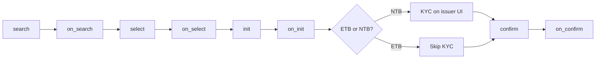

# ONDC Fixed Deposit Protocol

**Multiplus ONDC FD Protocol v1.0** — open-network specification for Fixed Deposit discovery, booking, and post-issuance servicing on the ONDC Financial Services network.

| | |
|---|---|
| **Domain** | `ONDC:FIS:FD` |
| **Protocol version** | 1.0.0 |
| **BRD version** | 1.0 (06 Jul 2026) |
| **Gap analysis** | 14 Jul 2026 — all four gaps resolved |
| **TSP** | Multiplus Finserv |

> **Full protocol guide (ONDC submission):** See **[PROTOCOL.md](./PROTOCOL.md)** for the complete end-to-end specification — flows, states, fund flow, KYC model, post-booking journeys, error handling, and integration checklist.

---

## Overview

Fixed deposits are one of the primary savings instruments for Indian households. Today, most FD bookings happen through bank branches or closed bilateral aggregator platforms. This protocol defines how FD products from **Scheduled Commercial Banks (SCBs)**, **Small Finance Banks (SFBs)**, and **deposit-accepting NBFCs (NBFC-Ds)** can be discovered, compared, booked, and serviced through any ONDC buyer app — using a single Beckn/ONDC integration.

### Value by participant

| Participant | What this protocol enables |
|-------------|---------------------------|
| **Investor** | Compare FD offers from all participating issuers in one place — rates, tenure, payout frequency, premature terms, DICGC/credit rating |
| **Buyer App (BAP)** | One protocol integration to all issuers; no bilateral custom integrations per bank |
| **Seller App / Issuer (BPP)** | Distribution reach via buyer apps; KYC, AML, and fund custody remain with the issuer |
| **TSP (Multiplus)** | White-label orchestration, routing, and audit across buyer and seller integrations |

### Core design principles

1. **Direct fund flow** — Investor payments go to the issuer's designated account. Neither the buyer app nor ONDC holds or routes customer funds.
2. **Issuer-owned compliance** — KYC and AML are completed on the issuer's interface. The BAP collects data; the BPP owns verification.
3. **Business vs transport separation** — Attribute rules, flows, and reference payloads are organized under `api/components/` (FIS14-style).
4. **Open discovery** — `search` broadcasts to all BPPs via the Gateway. Bank name and rate sorting are BAP-side display filters, not network filters.

---

## Repository structure

Canonical **ONDC FIS14-style layout (JSON-only)**. Start at `index.json`.

```
ONDC/
├── index.json                                     ← Root manifest (domain, version, all refs)
├── README.md
└── api/components/                                ← Protocol spec (FIS14-style)
    ├── beckn-actions.json
    ├── attributes/fixed-deposits/
    ├── flows/fixed-deposits/
    ├── examples/fixed-deposits/                   ← 23 ONDC-format reference payloads
    ├── error_codes/, enums/, tags/, docs/
```

### Migration status

| Phase | Status | Scope |
|-------|--------|-------|
| **1 — Scaffold** | Done | Component tree, capabilities, BRD compliance |
| **2 — Examples** | Done | 23 clean ONDC-format examples |
| **3 — Attributes** | Done | Per-action attribute definitions |
| **4 — Error codes** | Done | 27 codes, validation rules, attribute wiring |
| **5 — Flows** | Done | 7 flows with full step cross-links |
| **6 — UI/build** | Skipped | Not required |
| **7 — Deprecate** | Done | Removed legacy `protocol/` and `schema/` |

### Which file to use when

| Need | File |
|------|------|
| Start here — domain, version, component index | `index.json` |
| Capabilities, issuers, payment modes | `api/components/docs/capabilities.json` |
| BRD compliance and gap resolution | `api/components/docs/brd-compliance.json` |
| Status lifecycle and journeys | `api/components/docs/lifecycle-and-states.json` |
| Error codes (823xxx) | `api/components/error_codes/index.json` |
| Validation rules | `api/components/docs/validation-rules.json` |
| Per-action error wiring | `api/components/attributes/fixed-deposits/<action>.json` → `validation_rules`, `error_codes` |
| Enums and tag groups | `api/components/enums/fixed-deposits.json`, `api/components/tags/fixed-deposits.json` |
| Flow definitions | `api/components/flows/index.json` |
| Single journey (steps + cross-links) | `api/components/flows/fixed-deposits/<flow-id>.json` |
| Beckn action registry | `api/components/beckn-actions.json` |
| Build or validate network calls | `api/components/examples/fixed-deposits/<action>/*.json` |
| Example catalog | `api/components/examples/fixed-deposits/index.json` |
| Field meanings and mandatory rules | `api/components/attributes/fixed-deposits/<action>.json` |
| Attribute index, scope, gap coverage | `api/components/attributes/fixed-deposits/index.json` |
| Trace how BRD gaps were resolved | `api/components/docs/brd-compliance.json` → `gap_analysis` |

Reference payloads live in `api/components/examples/fixed-deposits/` alongside attributes, flows, and docs.

---

## Participants

| Role | Code | Description |
|------|------|-------------|
| Buyer App | **BAP** | Consumer platform — investor-facing discovery and journey UI |
| Seller App | **BPP** | Provider platform — RBI-regulated deposit-accepting entity |
| Technology Service Provider | **TSP** | Integration orchestration (Multiplus Finserv) |
| ONDC Gateway | — | Broadcasts `search` to all participating BPPs |
| Off-network services | — | UIDAI, CKYC/CERSAI, payment gateway, ONDC Registry |

**Eligible issuer types (v1):** SCB, SFB, NBFC-D

---

## v1 scope

### In scope

| Dimension | v1 coverage |
|-----------|-------------|
| **Product** | Fixed Deposits |
| **Investors** | Individual resident investors only (`INVESTOR_TYPE=INDIVIDUAL_RESIDENT`) |
| **Issuers** | SCBs, SFBs, NBFC-Ds permitted to accept public deposits |
| **Payment modes** | UPI, IMPS, Net Banking |
| **Post-booking** | Status query, premature/partial withdrawal, interest certificates, Form 121 |

### Out of scope (future versions)

Joint account holders, NRIs (NRE/NRO), minors with guardian, Hindu Undivided Families (HUF), and corporate investors. The BAP must reject these investor types before initiating a network call.

> v1 covers Individual resident investors only. Joint account holders, Non-Resident Indians (NRI/NRE/NRO), minors (with guardian), Hindu Undivided Families (HUF), and corporate investors are out of scope and will be addressed in subsequent protocol versions.

---

## Booking flows

### End-to-end journey



### NTB — New to Bank (standard flow)

Investor has no existing relationship with the issuer. Full KYC required.

```
search → on_search → select → on_select → init → on_init → KYC on issuer UI → confirm → on_confirm
```

After `init`, the BPP performs a PAN lookup against its core banking system. If the investor is **NTB**, `on_init` returns:

- `customer_type`: `NTB`
- `status`: `NTB_CONFIRMED` or `KYC_PENDING`
- `kyc_url`: **mandatory** — investor completes KYC on the issuer's interface

### ETB — Existing to Bank (abbreviated flow)

Investor already banks with the issuer (savings account, KYC on file) but may never have booked an FD via ONDC.

```
search → on_search → select → on_select → init → on_init → confirm → on_confirm
```

When `on_init` returns `customer_type=ETB` and `status=ETB_CONFIRMED`:

- Issuer retrieves existing KYC from core banking — **no `kyc_url`**
- Investor proceeds directly to bank account linkage and payment
- Nominee details may be pre-filled from issuer records

> **Note:** ETB is broader than ONDC "repeat investment." Repeat investment only skips KYC for investors who previously booked via ONDC with the same issuer. ETB covers any investor the issuer already recognises through its core banking system.

### ETB/NTB status values

| Status | Meaning |
|--------|---------|
| `ETB_CHECK_PENDING` | BPP is checking PAN against core banking |
| `ETB_CONFIRMED` | Investor recognised — skip KYC |
| `NTB_CONFIRMED` | New investor — full KYC required |
| `KYC_PENDING` | Awaiting KYC completion on issuer UI |

---

## Key attributes by stage

### Discovery and booking

| Stage | Action | Direction | Key attributes |
|-------|--------|-----------|----------------|
| Discovery trigger | `search` | BAP → Gateway → BPP | `tenure_preference`, `senior_citizen`, `interest` — all **optional** |
| Offer discovery | `on_search` | BPP → BAP | `issuer_name`, `issuer_type`, `interest_rate`, `tenure`, `minimum_deposit_amount`, `interest_payout_frequency`, `premature_withdrawal_allowed`, `penalty_rate`, `dicgc_insured` |
| Offer selection | `select` | BAP → BPP | `deposit_amount`, `payout_mode`, `maturity_instruction` |
| Offer confirmation | `on_select` | BPP → BAP | Confirmed terms, maturity amount/date estimates |
| KYC and details | `init` | BAP → BPP | PAN, name, DOB, mobile, address, bank/UPI, nominee or no-nominee declaration, `INVESTOR_TYPE=INDIVIDUAL_RESIDENT` |
| ETB/NTB check | `on_init` | BPP → BAP | `customer_type`, `status`, `kyc_url` (NTB only), `bank_verification_status`, `order_id` |
| Payment | `confirm` | BAP → BPP | `payment_mode`, `amount`, `transaction_id`, `payment_status` |
| Receipt | `on_confirm` | BPP → BAP | FD reference, principal, rate, tenure, start/maturity dates, maturity amount, interest schedule, TDS, status |

### `search` — what is and is not a network filter

| Filter | Network (`search`) | BAP-side (after `on_search`) |
|--------|-------------------|------------------------------|
| Tenure preference | Yes (optional) | — |
| Senior citizen flag | Yes (optional) | — |
| Minimum interest rate | Yes (optional) | — |
| Bank / issuer name | **No** | Yes — display filter |
| Interest rate sorting | **No** | Yes — display filter |

### `on_search` — issuer-type-specific fields

| Attribute | SCB / SFB | NBFC-D |
|-----------|-----------|--------|
| `dicgc_insured` | Optional (typically true, up to ₹5L) | Not applicable |
| `credit_rating_agency` | Not required | **Conditional mandatory** (CRISIL, ICRA, CARE) |
| `credit_rating` | Not required | **Conditional mandatory** (AAA, AA+, A) |
| `rating_last_updated` | Not required | Optional (recommended) |

NBFC-D deposits carry credit risk and are not DICGC insured. Credit rating disclosure is required under RBI Fair Practices Code for NBFC deposit products.

### `on_confirm` — payment receipt (mandatory response)

`on_confirm` is the **only** way the BAP receives the FD reference number and maturity details. All ten attributes are mandatory:

1. FD reference number  
2. Principal amount  
3. Interest rate (% p.a.)  
4. Tenure (string, e.g. "12 months")  
5. Start date (DD-MM-YYYY)  
6. Maturity date (DD-MM-YYYY)  
7. Maturity amount  
8. Interest schedule (payout dates/amounts; null for cumulative)  
9. TDS details  
10. Status (`BOOKED` or `ACTIVE`)

---

## Post-booking services

| Use case | Actions | Key request attributes | Key response attributes |
|----------|---------|------------------------|-------------------------|
| **Status query** | `status` / `on_status` | `fd_reference_number` | `status`, `accrued_interest` (once ACTIVE) |
| **Premature withdrawal** | `cancel` / `on_cancel` | `withdrawal_type=FULL` | `closure_date`, `penalty_applied`, `final_interest_paid`, `tds_deducted`, `net_amount_credited` |
| **Partial withdrawal** | `cancel` / `on_cancel` | `withdrawal_type=PARTIAL`, `withdrawal_amount` | Same as above |
| **Interest certificate** | `support` / `on_support` | `document_type=INTEREST_CERTIFICATE` | `document_url` |
| **Form 121 (TDS declaration)** | `support` / `on_support` | `document_type=FORM_121`, `financial_year` | `document_url` |

### Form 121

Form 121 replaces Form 15G and Form 15H under the Income Tax Act 2025, effective from **FY 2026-27** (April 1, 2026). Investors submit Form 121 to the issuer to declare eligibility for nil/lower TDS deduction. When requesting Form 121 via `support`, `financial_year` is mandatory (e.g. `2025-26`).

---

## Supported enums (reference)

| Enum | Values |
|------|--------|
| Tenure preference | `ANY`, `BELOW_2Y`, `2Y_TO_3Y`, `ABOVE_3Y` |
| Interest payout frequency | `MONTHLY`, `QUARTERLY`, `HALF_YEARLY`, `CUMULATIVE` |
| Payout mode | `CUMULATIVE`, `NON_CUMULATIVE` |
| Maturity instruction | `AUTO_RENEW_PRINCIPAL`, `AUTO_RENEW_PRINCIPAL_AND_INTEREST`, `CREDIT_TO_BANK_ACCOUNT` |
| Payment mode | `UPI`, `IMPS`, `NET_BANKING` |
| Payment status | `SUCCESS`, `PENDING`, `FAILED` |
| Customer type | `ETB`, `NTB` |
| Issuer type | `SCB`, `SFB`, `NBFC-D` |
| Withdrawal type | `FULL`, `PARTIAL` |
| Document type | `INTEREST_CERTIFICATE`, `FORM_121` |
| FD status | `ETB_CHECK_PENDING`, `ETB_CONFIRMED`, `NTB_CONFIRMED`, `KYC_PENDING`, `PAYMENT_PENDING`, `BOOKED`, `ACTIVE`, `MATURED`, `CANCELLED`, `KYC_FAILED`, `PAYMENT_FAILED` |

Full enum definitions: `api/components/enums/fixed-deposits.json`

---

## Validation rules

| Rule | Detail |
|------|--------|
| **Fund flow** | Payment destination must be the issuer's designated account. BAP and ONDC never hold investor funds. |
| **Search filters** | Only `tenure_preference`, `senior_citizen`, and `interest` are valid network search tags. |
| **Investor eligibility** | `init` must send `INVESTOR_TYPE=INDIVIDUAL_RESIDENT`. Reject out-of-scope types at BAP. |
| **Nominee** | Either nominee details (name, relationship, DOB) **or** `no_nominee_declaration=true` must be present (RBI Nov 2025). Nominee must not block order confirmation. |
| **Bank or UPI** | Provide `bank_account_number` + IFSC **or** `upi_handle` — one pair must be present. |
| **ETB/NTB branch** | `kyc_url` mandatory for NTB; omit for ETB_CONFIRMED. |
| **Payment amount** | `confirm` amount must match `select` deposit amount. Payment mode is chosen at `confirm`, not earlier. |
| **NBFC credit rating** | `on_search` must include `credit_rating_agency` and `credit_rating` when `issuer_type=NBFC-D`. |
| **Partial withdrawal** | `withdrawal_amount` required when `withdrawal_type=PARTIAL`. |
| **Form 121** | `financial_year` required when `document_type=FORM_121`. |
| **Date format** | DD-MM-YYYY for business dates unless a Beckn ISO timestamp field is specified. |

---

## BRD compliance matrix

All BRD requirements and the four gap-analysis items are **`covered: true`** in `api/components/docs/brd-compliance.json`.

| Requirement | Protocol reference |
|-------------|-------------------|
| Open discovery | `search` / `on_search` |
| ETB / NTB (Gap 1) | `on_init`, `ETB_BOOKING` |
| Individual resident v1 (Gap 2) | `scope`, `INVESTOR_TYPE` on init |
| NBFC credit rating (Gap 3) | `on_search` conditional fields |
| Form 121 (Gap 4) | `support` → `FORM_121` |
| VKYC + refund SLA | `vkyc` block, `on_status` |
| Portfolio view | `on_status`, `support` → `PORTFOLIO_VIEW` |
| Nominee / maturity update | `support` → `NOMINEE_UPDATE`, `MATURITY_INSTRUCTION_UPDATE` |
| Closure confirmation | `support` → `CLOSURE_CONFIRMATION` |
| IGM grievance | `issue` / `on_issue` |

## BRD gap analysis (18 Aug 2026)

| # | Gap | Resolution |
|---|-----|------------|
| 1 | ETB / NTB | `on_init` branching |
| 2 | MVP investor eligibility | v1 individual resident only |
| 3 | NBFC-D credit rating | Conditional `on_search` |
| 4 | Form 121 | Replaces 15G/15H from FY 2026-27 |

Full gap analysis detail: `api/components/docs/brd-compliance.json` → **`gap_analysis`**

---

## Attribute legend

Used throughout `api/components/attributes/fixed-deposits/`:

| Status | Meaning |
|--------|---------|
| **Mandatory** | Must always be present |
| **Optional** | May be omitted |
| **Conditional Mandatory** | Required only when a stated condition is met — see the attribute description |

---

## Getting started

1. Open `index.json` for the spec manifest and component paths.
2. Read `api/components/docs/capabilities.json` and `api/components/docs/lifecycle-and-states.json` for scope and journeys.
3. Use `api/components/examples/fixed-deposits/` for ONDC-format reference payloads per action.
4. Follow flows in `api/components/flows/fixed-deposits/` — each step links to attributes, examples, and error codes.
5. For field-level detail, use `api/components/attributes/fixed-deposits/<action>.json`.
6. Cross-check enums in `api/components/enums/fixed-deposits.json`, validation rules in `api/components/docs/validation-rules.json`, and error codes in `api/components/error_codes/index.json`.
7. Ensure `on_confirm` is handled — it is the only response that delivers the FD reference number and booking receipt.

---

## Related documents

| Document | Path |
|----------|------|
| Root manifest | `index.json` |
| Beckn action registry | `api/components/beckn-actions.json` |
| Capabilities | `api/components/docs/capabilities.json` |
| BRD compliance | `api/components/docs/brd-compliance.json` |
| Flow catalog | `api/components/flows/index.json` |
| Lifecycle and states | `api/components/docs/lifecycle-and-states.json` |
| Validation rules | `api/components/docs/validation-rules.json` |
| Error codes | `api/components/error_codes/index.json` |
| Attribute schema | `api/components/attributes/fixed-deposits/index.json` |
| Per-action attributes | `api/components/attributes/fixed-deposits/<action>.json` |
| Example catalog | `api/components/examples/fixed-deposits/index.json` |
| ONDC-format examples | `api/components/examples/fixed-deposits/<action>/*.json` |
| BRD gap analysis | `api/components/docs/brd-compliance.json` |

---

*Multiplus ONDC Fixed Deposit Distribution Protocol v1.0 — ONDC Financial Services (`ONDC:FIS:FD`)*
