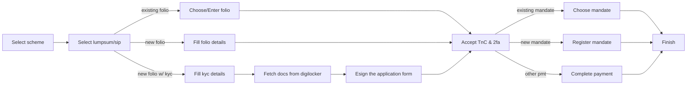
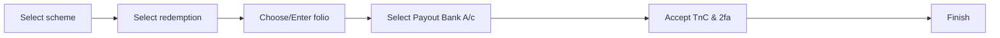

## Capabilities
The following capabilities are supported through ONDC protocol for MF transactions

### Schemes
- Regular schemes

### Transactions
- Lumpsum purchase
- SIP purchase
- Redemption

### Investors
- Resident Individual (>18y age)

### Accounts
- Single holding pattern folios (non-demat)
- Digilocker based eKYC for KRA-KYC non-compliant investors

### Payments
For purchase transactions, Payment is collected by the seller app directly from the investors, through the following modes
- Netbanking
- UPI Collect
- eNACH Mandates
- UPI Autopay

### Partner tagging
- Sub-brokers

## Investor Journeys

### Purchase Journey

### Redemption Journey

## Protocol Details

- [Discovery stage is detailed here](./stage-discovery.md)
- [Order stage is detailed here](./stage-order.md)
- [Fulfillment stage is detailed here](stage-fulfillment.md)
- [Order and Payment lifecycle is detailed here](./lifecycle-and-states.md)
