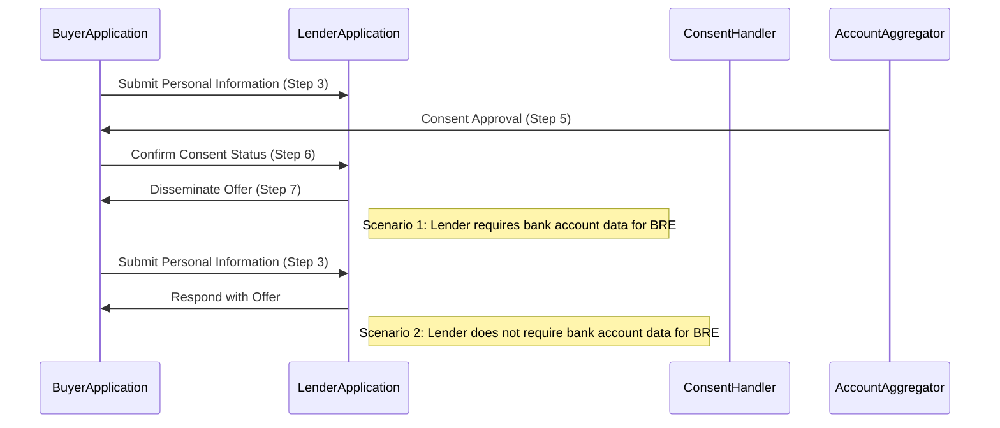

# Use Case: Buyer-Lender Interaction
  When the buyer completes the personal information form (step 3) within the buyer application, the submitted form is transmitted to the lender application. Following this initial step, there are two potential paths for implementation.

### Scenario 1: 
If the lender necessitates the bank account data of the buyer to execute the Borrower Risk Evaluation (BRE) for generating offers.

### Journey Steps:

1. The buyer application transmits the personal information of the buyer to the lender (step 3, form submission).
2. The lender furnishes the "Consent Handler" to the buyer application (step 5, /On_select).
3. The buyer application obtains consent approval with the account aggregator.
4. Once the consent status is confirmed by the buyer application to the lender (step 6, /Select).
5. The lender can then disseminate the offer to the buyer application (step 7, /On_select).

## Scenario 2:
  If the lender doesn't require the bank account data of the buyer to execute the BRE for generating offers. This could be due to various reasons, such as
  * The lender already possesses approved consent for the buyer.
  * The lender doesn't require the data for executing the BRE.
  * And so forth.

### Journey Steps:

1. The buyer application transmits the personal information of the buyer to the lender (step 3, form submission).
2. The lender replies with the offer in response to the buyer application's request (Step 4, /Select by BAP – step 7, /On_select by BPP).

(P.S.: Step 5 and 6 are not necessary in this scenario)

## Key Points to Remember:

* There could be a combination of lenders, some requiring data while others do not
* The buyer application must comprehend that the offers should only be displayed once all lenders return with a valid offer
