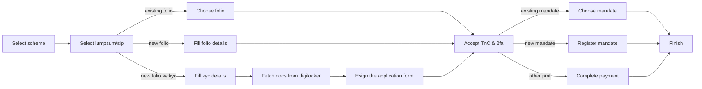
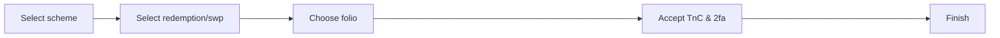
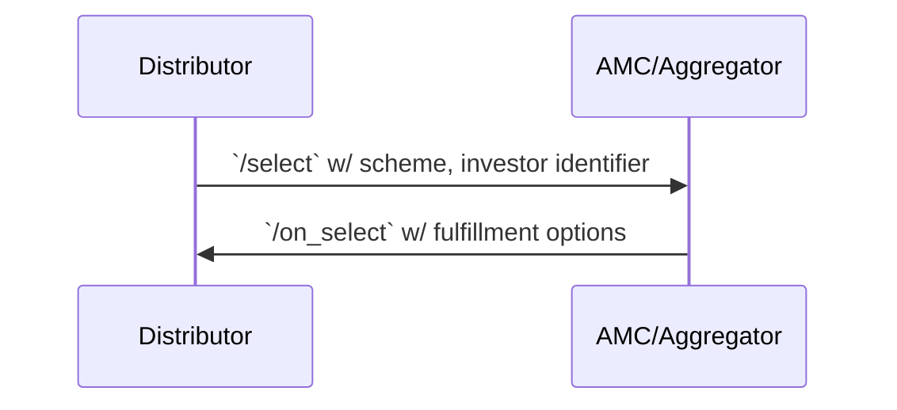
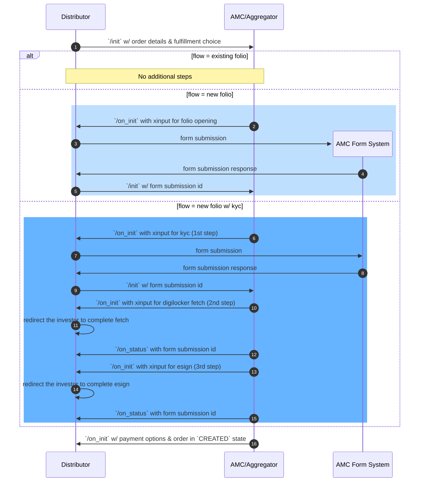
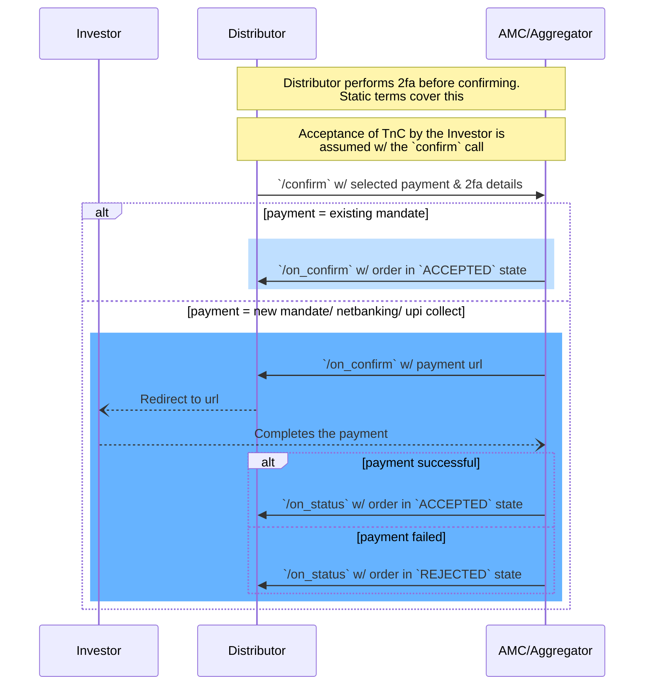
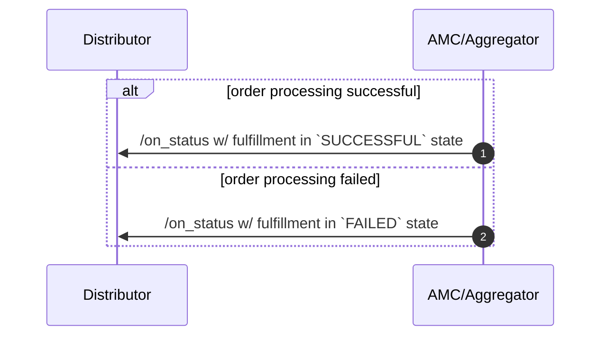

### Purchase Flow

### Redemption Flow

---

### Selection

Seller app checks the investor identifier to determine if he is kyc compliant and if he already has existing folios and if it can accept orders from that investor for the given item, it responds with the possible fulfillment options. Each scheme can possibly support different fulfillment options.

Investor identifier can be folio number, pan number.

##### Fulfillment Options

1. `LUMPSUM`  
Investor can make a one time lumpsum purchase
2. `SIP`  
Investor can make a recurring purchase
3. `REDEMPTION`  
Investor can make a one time redemption
4. `SWP`  
Investor can make a recurring redemption
---

### Initiation
Buyer app makes an `init` call with the details of the investor, order and the fulfillment choice.

Seller app checks if all the details are available and correct. If any additional input is needed, seller app responds with the list of required information (one or multiple steps).

3 possible workflows
1. Existing folio  
Seller app checks for the folio validity

2. New folio  
Seller app responds with the details needed to open a new folio

3. New folio with KYC  
Seller app checks for kyc and respond with the details needed to perform kyc

Seller app can choose to support all or any of the above scenarios. It will error out for cases it won't support.

If everything is ready, seller app responds with different payment options through which the investor can make the payment to complete this order. And the order is created.

##### Payment Options
**New Mandate Registration**  
`amount` represents the mandate limit. It should be atleast the sip instalment amount. Distributor can propose a number, but AMC will have the final say on this.

**Existing Mandate Selection**  
If the investor has an existing mandate, AMC will send that along with masked bank a/c number against which the mandate is registered.

**Netbanking**  
For one time payment, if netbanking is supported for the given investor's bank a/c, AMC will respond with this option.

**UPI Collect**  
For one time payment, if upi collect is supported for the given investor's bank a/c, AMC will respond with this option.

**UPI Intent**  
TBD

**NEFT/RTGS**  
AMC will respond with details of the bank a/c into which the Investor has to make payment through neft/rtgs. This can be useful for corporate investors.

Order in `CREATED` state marks the end of this stage.

---

### Confirmation
Buyer app sends all the details of the investor and the transaction and the selected payment option along with all the negotiated terms in the previous step. Buyer app performs 2fa and sends those details.

Depending on the selected payment option, seller app responds with either a payment URL or order in accepted state.

Order in `ACCEPTED` or `REJECTED` state marks the end of this stage.

---

### Fulfillment

After the order is accepted, seller app performs the processing and responds with the state of order processing.

Fulfillment in `SUCCESSFUL` or `FAILED` state marks the end of this stage

---

##### Multiple Items in an order
Only one item in an order is supported
