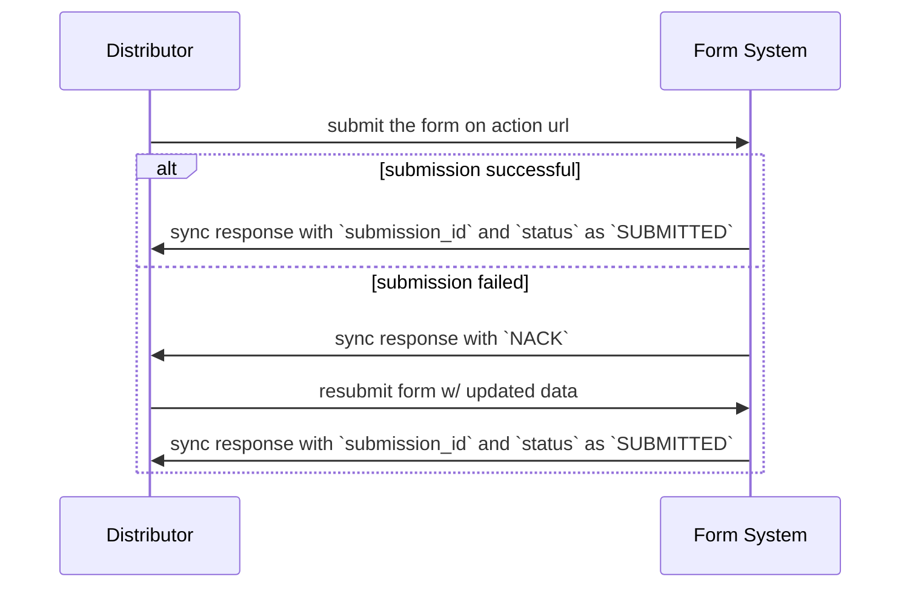
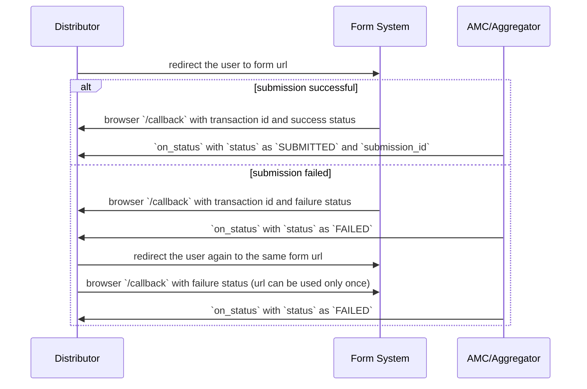
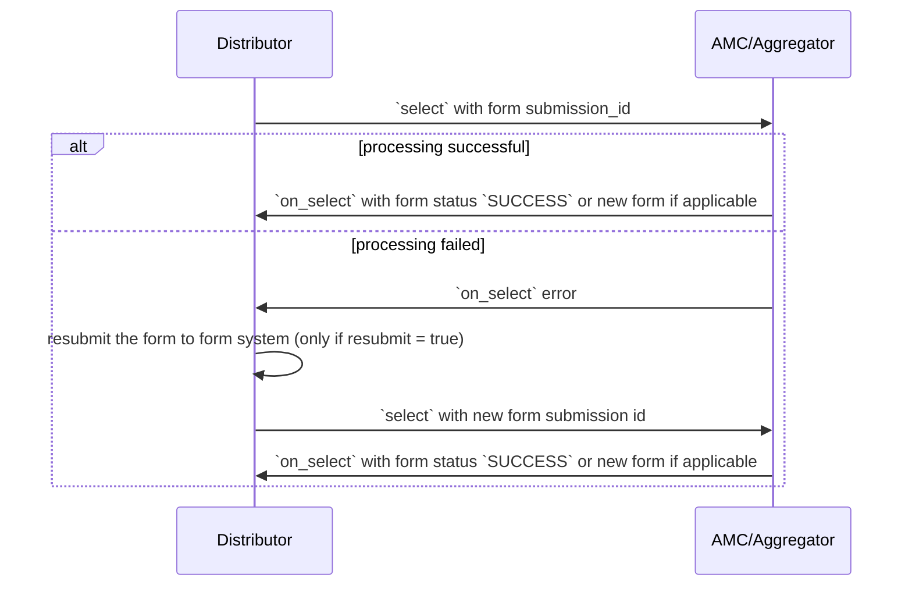
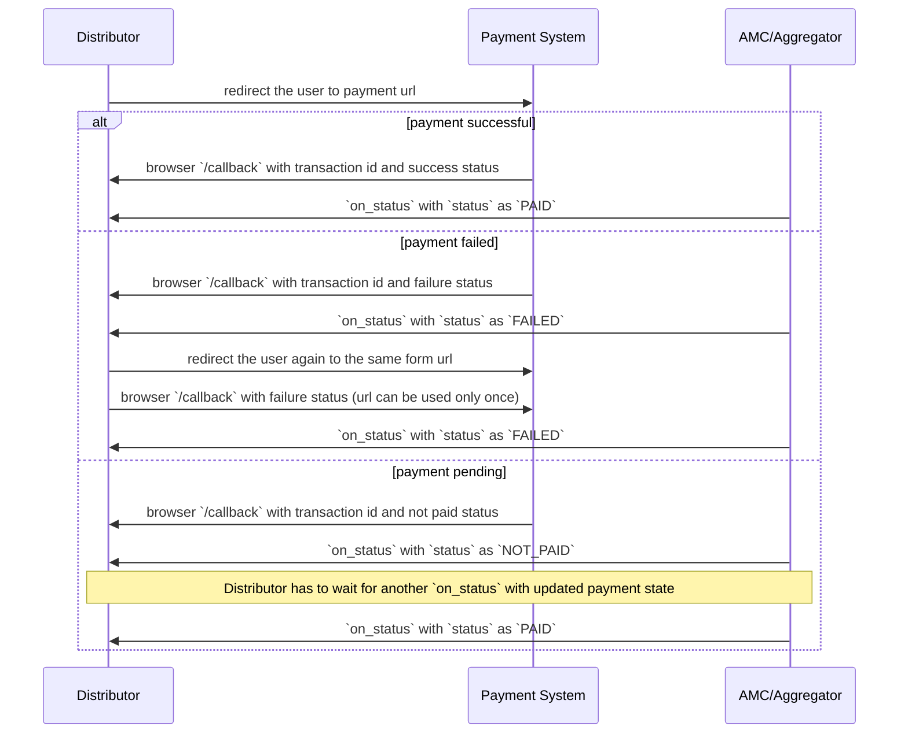

## Form Submission

### `text/html` forms
In XInput, `text/html` forms are used to capture additional information from user. 

Buyer app submits the form to the action url provided in the form html. Seller app will do basic sanity checks like format of the inputs, required fields etc and respond with `status` as `SUBMITTED` and a `submission_id` which is used by the buyer app in the next action call. 
If the sanity checks fail, seller app will respond with `NACK` with an appropriate error code. Buyer app can retry with updated data.

### `application/html` forms
The buyer app redirects the user's browser to a seller app provided url. After completing the activity, seller app should take the responsibility to redirect the user's browser back to the buyer app so the user can continue his journey on the buyer application. We will follow the below conventions in handling these redirects.

Seller app will redirect back the user to this url: `GET <bap_subscriber_url>/callback` with the following query params:
1. `transaction_id` (transaction id used in the context)
2. `status` - form status: `SUBMITTED` / `FAILED`
3. `form_id`
4. `submission_id` (only in success case)

Seller app will additionally send `on_status` call containing the form status and `submission_id` in `form_response`

## Form Processing
In both `text/html` and `application/html` forms: Buyer app will take `submission_id` received during form submission, use it in `form_response` in the next action call. Seller app will then process the form data

#### if processing successful
Seller app will either send the next form if applicable or send the `status` as `SUCCESS` in `form_response`.

#### if processing failed
Seller app will respond with error in the on action call. Buyer app can submit the same form with updated data, receive a submission id and make an action call for processing it again.

## Payment URL Redirects
Payment URL redirects will work similar to `application/html` form redirects (detailed above). Payment submission and processing are happening together in the redirection flow, unlike forms, where submission and processing is split into two steps.

The buyer app redirects the user's browser to a seller provided payment url. After collecting the payment, seller app should take the responsibility to redirect the user's browser back to the buyer app so the user can continue his journey on the buyer application. We will follow the below conventions in handling these redirects.

Seller app will redirect back the user to this url: `GET <bap_subscriber_url>/callback` with the following query params:
1. `transaction_id` (transaction id used in the context)
2. `status` - payment status: `NOT_PAID` / `PAID` / `FAILED`
3. `payment_id`

Seller app will additionally send `on_status` call containing the payment status

