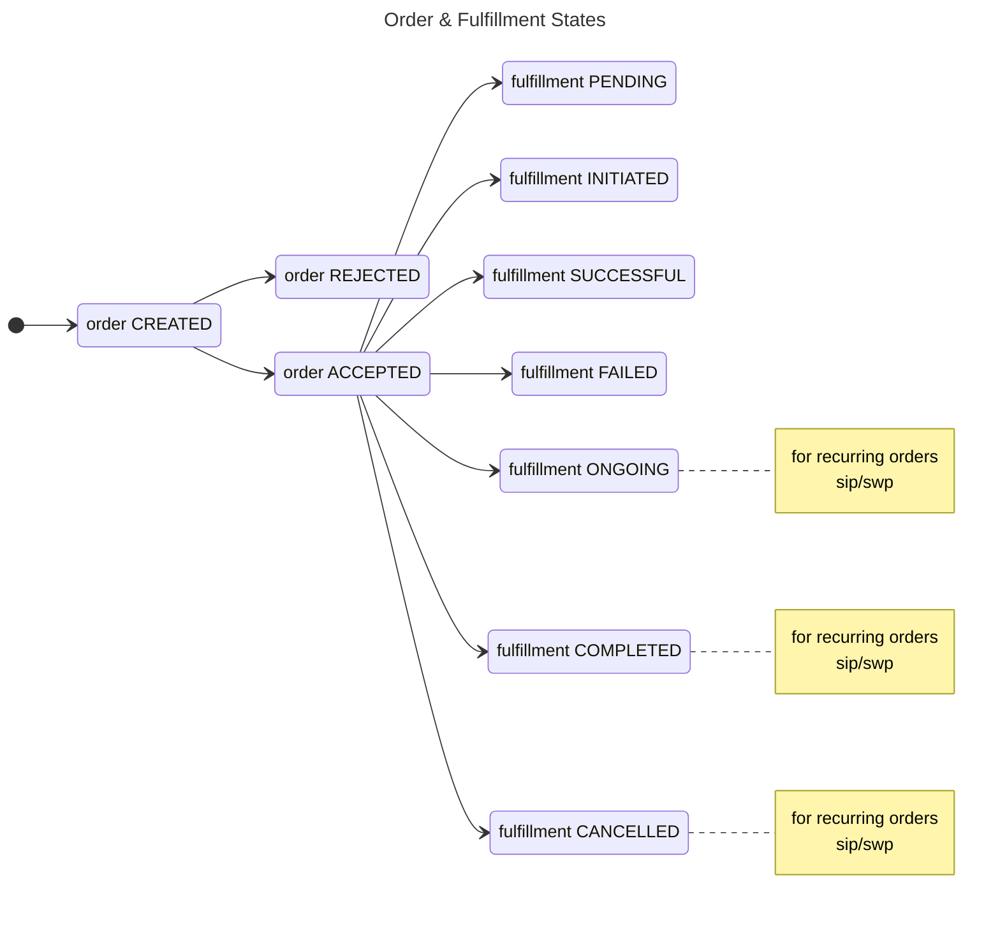

## Order

### States

- `CREATED`: Draft order.
- `ACCEPTED`: Order is accepted by BPP. This means all validations are done and the buyer app can facilitate payment
- `REJECTED`: Order is rejected by BPP. This means some validations have failed and the order cannot be accepted
- `CANCELLED`: Order is cancelled either by BAP or BPP. This means for sip order, no more instalments will be generated

## Fulfillment

Fulfillment is the order processing activity, which happens after the order is accepted.

### Types

- `LUMPSUM`
- `SIP`
- `REDEMPTION`
- `SIP_INSTALMENT`

### States

- `PENDING`: In case of purchases, fulfillment starts only after payment is done. This state indicates that the order is confirmed, but the payment is pending.
- `INITIATED`: This means the fulfillment is started. In case of one time orders - the orders are sent for processing. In case of recurring orders - the instalments will be generated as per the schedule
- `ONGOING`: For recurring orders (sip, swp), this means the instalments are ongoing as per the schedule
- `COMPLETED`: For recurring orders (sip, swp), this means the instalments are completed as per the schedule and no new instalments will be generated
- `CANCELLED`: For recurring orders (sip, swp), this means the order is cancelled by the seller app and no new instalments will be generated
- `SUCCESSFUL`: Order is successfully processed. For purchase orders, this means units have been allotted.
- `FAILED`: Order is not processed. Typically failed by the AMC/RTA due to invalid kyc/bank-account among other reasons.

## Payment

### Types

- `PRE_FULFILLMENT`

### Modes

- `MANDATE_EXISTING`
- `MANDATE_REGISTRATION`
- `NETBANKING`
- `UPI_PG` (upi payment through pg link)
- `UPI_URI` (upi payment through intent/qr via upi uri)
- `UPI_COLLECT` (upi payment through collect request)
- `MANDATE_DEBIT`

### States

- `PAID`: Payment is successfully collected
- `NOT_PAID`: Payment is pending
- `FAILED`: Payment failed either due to incorrect user action or system issues
