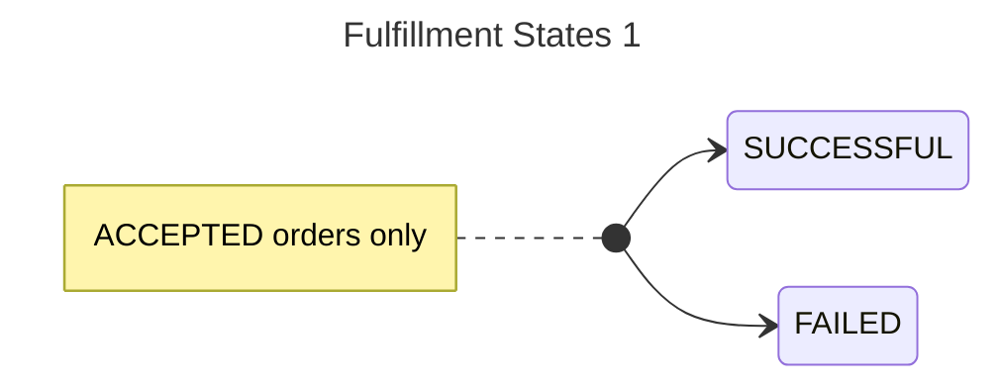
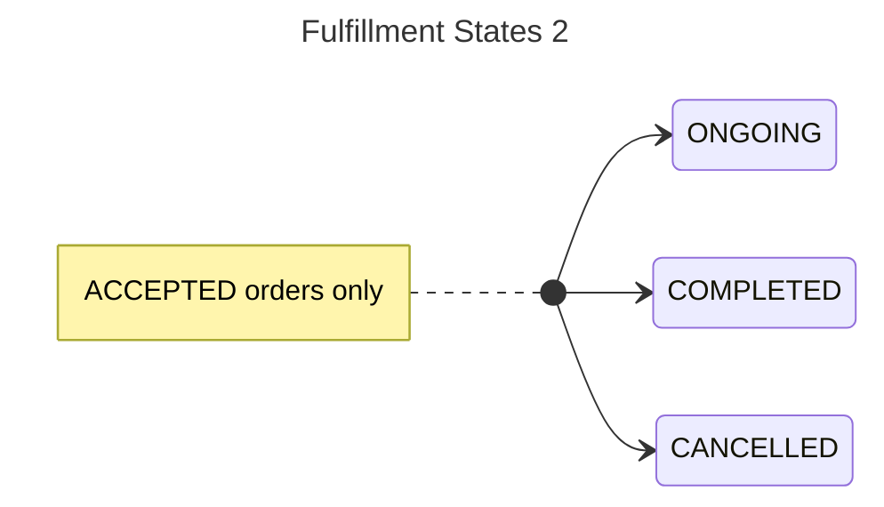

# Order

### Types

- `PURCHASE` - All onetime(lumpsum) and recurring(sip) buy orders
- `REDEMPTION` - All onetime and recurring(swp) sell orders

### States

- `CREATED`: Draft order.
- `ACCEPTED`: Order is accepted by BPP. For purchase orders, this means a successful payment.
- `REJECTED`: Order is rejected by BPP. In most cases this is due to payment failures.

# Fulfillment

Fulfillment is the order processing activity, which happens after the order is accepted.

### Types

- `LUMPSUM`
- `SIP`
- `REDEMPTION`
- `SWP`
- `SIP_INSTALMENT`

### States

- `SUCCESSFUL`: Order is successfully processed. For purchase orders, this means units have been allotted.
- `FAILED`: Order is not processed. Typically failed by the AMC/RTA due to invalid kyc/bank-account among other reasons.

# Payment

### Types

- `EXISTING_MANDATE`
- `NEW_MANDATE_REGISTRATION`
- `NETBANKING`
- `UPI_COLLECT`
- `MANDATE_DEBIT`

### States

- `PAID`: Payment is successfully collected
- `NOT_PAID`: Payment is pending
- `FAILED`: Payment failed either due to incorrect user action or system issues
