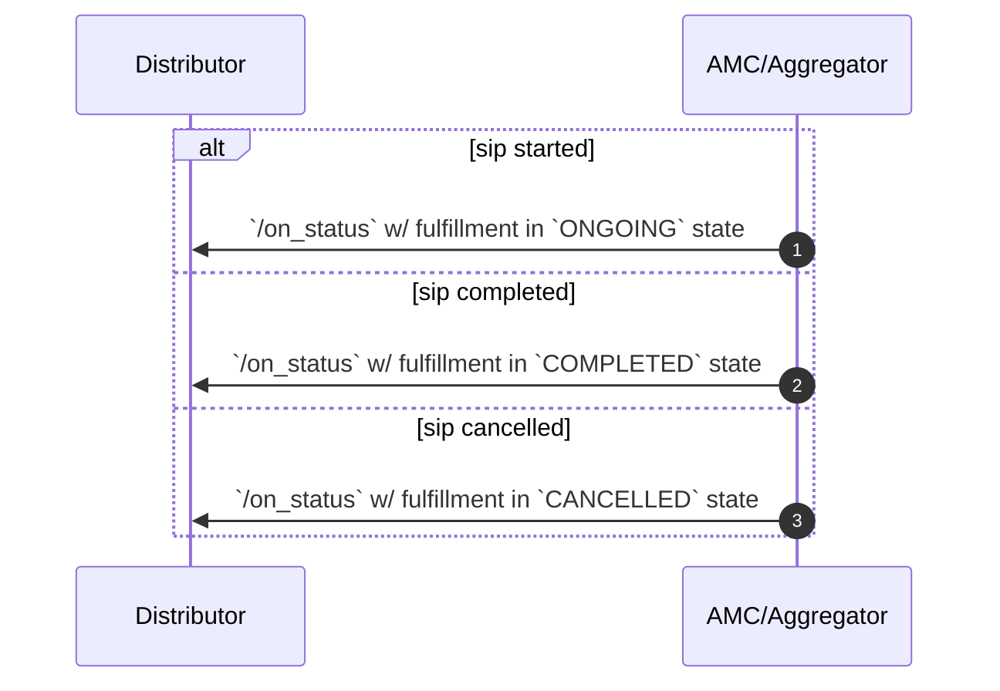
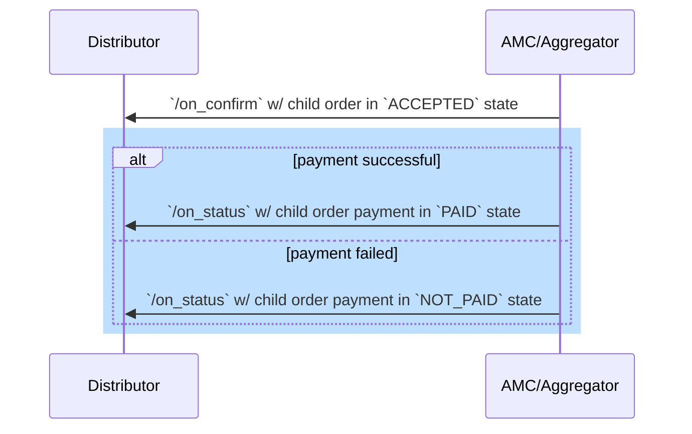
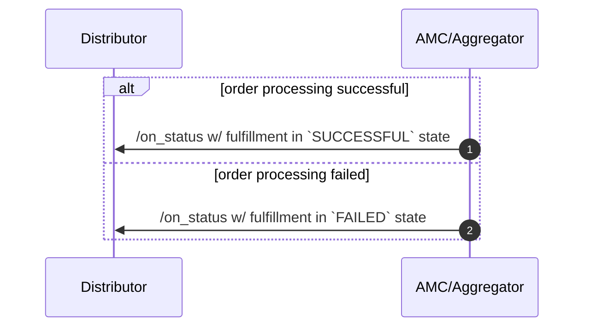

### Fulfillment (Recurring: SIP, SWP)

After the order is accepted, seller app performs the processing and responds with the state of order processing (fulfillment)

For recurring orders, seller app creates a new order for every instalment and it goes through the entire order lifecycle.

---

### Fulfillment (Onetime: Lumpsum, SIP Instalment, Redemption, SWP Instalment)

After the order is accepted, seller app performs the processing and responds with the state of order processing.

---

### Cancellation

Confirmed orders can be cancelled if allowed by the provider/bpp

#### lumpsum
1. cancellation can happen in fulfillment states = pending (i.e before payment is made)
2. provider can cancel if the payment is not received within a certain time period and mention the reason as payment not received

#### sip
1. cancellation can happen in fulfillment states = pending, ongoing
2. provider can cancel if the mandate is not registered within a certain time period and mention the reason as payment instrument not received

#### sip instalment
1. cancellation can happen in fulfillment states = pending (i.e before payment is made)

#### redemption
1. cancellation is not possible as the fulfillment gets started immediately after the order is accepted

Cancellation reasons are provided as enums