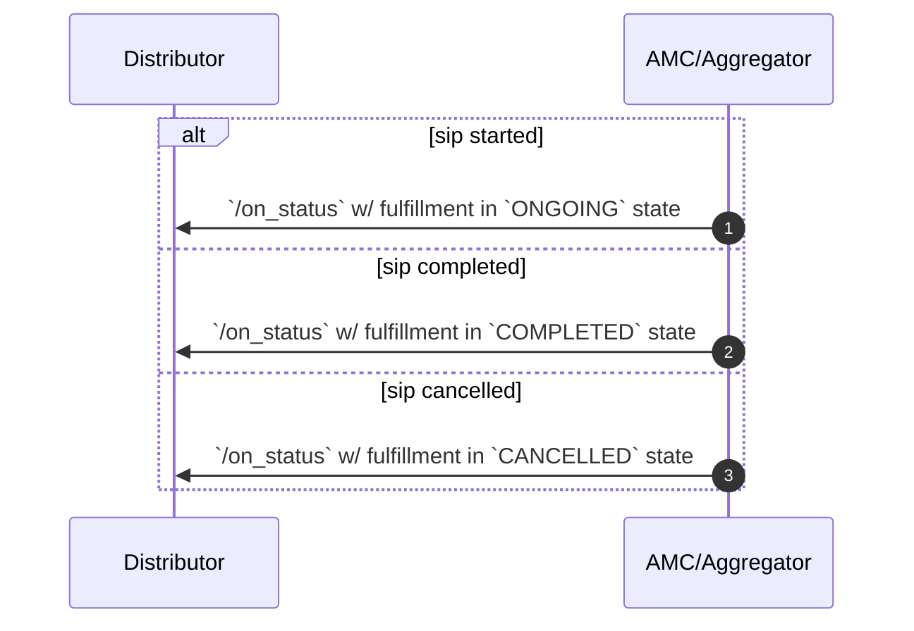
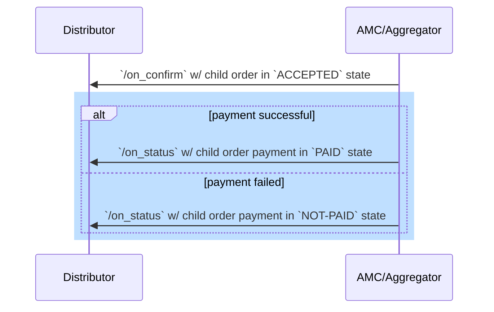
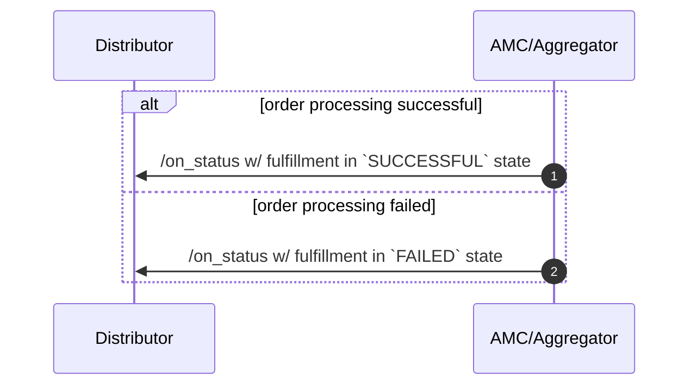

### Fulfillment (Recurring: SIP, SWP, STPs)

After the order is accepted, seller app performs the processing and responds with the state of order processing (fulfillment)

```mermaid
sequenceDiagram
    autonumber
    participant bap AS Distributor
    participant bpp AS AMC/Aggregator
    alt sip started
        bpp ->> bap: `/on_status` w/ fulfillment in `ONGOING` state
    else sip completed
        bpp ->> bap: `/on_status` w/ fulfillment in `COMPLETED` state
    else sip cancelled
        bpp ->> bap: `/on_status` w/ fulfillment in `CANCELLED` state
    end
```

For recurring orders, seller app creates a new order for every instalment and it goes through the entire order lifecycle.

```mermaid
sequenceDiagram
    participant bap AS Distributor
    participant bpp AS AMC/Aggregator
    bpp ->> bap: `/on_confirm` w/ child order in `ACCEPTED` state

    rect rgb(191, 223, 255)
    alt payment successful
        bpp ->> bap: `/on_status` w/ child order payment in `PAID` state
    else payment failed
        bpp ->> bap: `/on_status` w/ child order payment in `NOT-PAID` state
    end
    end
```

---

### Fulfillment (Onetime: Lumpsum, SIP Instalment, Redemption, SWP Instalment, STP Instalments)

After the order is accepted, seller app performs the processing and responds with the state of order processing.

```mermaid
sequenceDiagram
    autonumber
    participant bap AS Distributor
    participant bpp AS AMC/Aggregator
    alt order processing successful
        bpp ->> bap: /on_status w/ fulfillment in `SUCCESSFUL` state
    else order processing failed
        bpp ->> bap: /on_status w/ fulfillment in `FAILED` state
    end
```
---

### Cancellation

Confirmed orders can be cancelled if allowed by the provider/bpp

### Skip

A skip request can be used to skip a set of consecutive installments of a recurring order.

- Installments falling within the given range will be generated with a fulfillment state of cancelled. Such installments will be counted against the total number of installments in the recurring order.
- Both start and end dates are inclusive.
- The end date must be equal to or later than the start date.
- The start date must be in the future.
- Only the date part is considered. To avoid ambiguity, the time part must be `00:00:00.000`.
- A skip request must be placed before installment generation to take effect. Already-generated installments cannot be skipped.
- The number of consecutive installments that can be skipped varies by frequency.
- A skip request will be assigned an `id` once accepted. The same `id` can be used to disable the skip.

The state of a skip request is indicated by the label, with the following values:

- `ENABLED`: The skip request is active; pending installments falling within the range will be skipped.
- `DISABLED`: The skip request has been disabled.
- `COMPLETED`: The skip request has completed skipping all eligible installments in the given range.

#### lumpsum
1. cancellation can happen in fulfillment states = pending (i.e before payment is made)
2. provider can cancel if the payment is not received within a certain time period and mention the reason as payment not received

#### sip
1. cancellation can happen in fulfillment states = pending, ongoing
2. provider can cancel if the mandate is not registered within a certain time period and mention the reason as payment instrument not received

#### sip instalment
1. cancellation can happen in fulfillment states = pending (i.e before payment is made)

#### redemption
1. cancellation is not possible as the fulfillment gets started immediately after the order is accepted

Cancellation reasons are provided as pre-defined tags