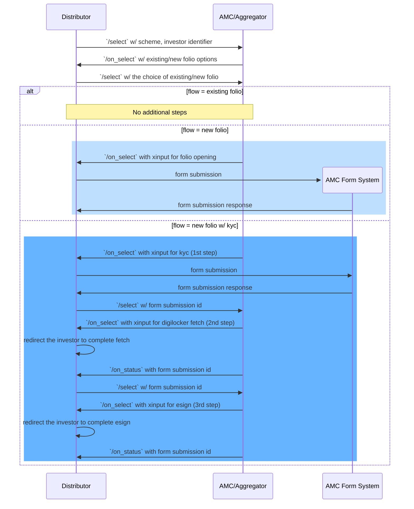
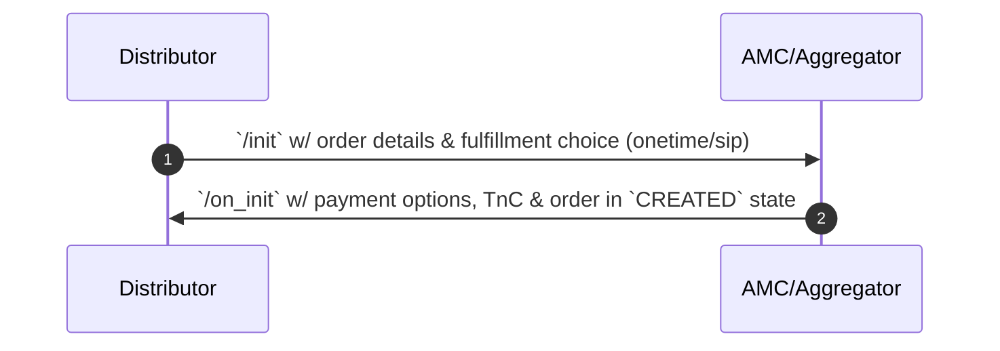
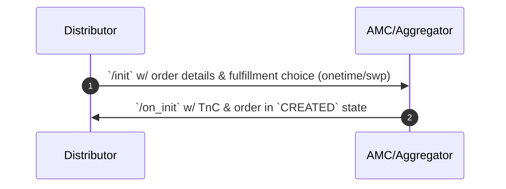
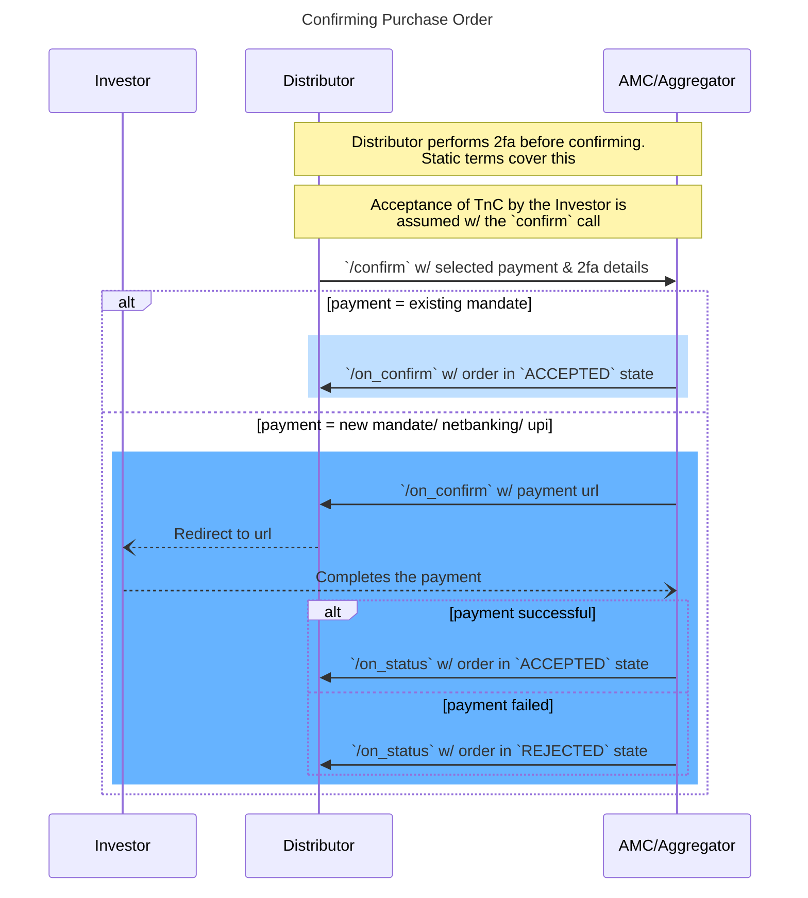
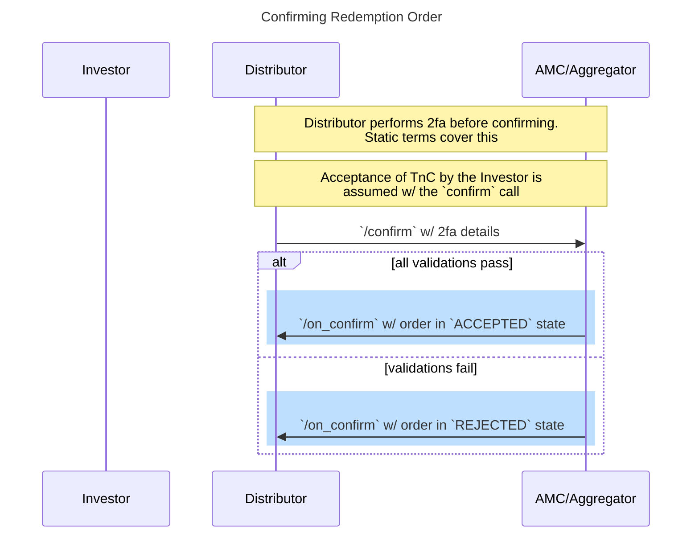

### Selection
Buyer app makes a `select` call with scheme, fulfillment and investor identifier (pan)

Seller app checks the investor identifier to determine if he is kyc compliant and if he already has existing folios and if it can accept orders from that investor for the chosen scheme, it responds with the possible options of existing/new folio.

Buyer app makes a `select` call with the chosen option of existing/new folio.

Seller app checks if all the details are available and correct. If any additional input is needed, seller app responds with the list of required information (one or multiple steps).

#### Possible Workflows
1. Existing folio  
Seller app checks for the folio validity

2. New folio  
Seller app responds with the details needed to open a new folio (1-step xinput)

3. New folio with KYC  
Seller app responds with the details needed to perform kyc (3-step xinput)

Seller app can choose to support all or any of the above scenarios. It will error out for cases it won't support.

---

### Initiation
Buyer app makes an `init` call with the details of the investor, order, the fulfillment choice and the bank a/c from where the investor want to make the payment

If everything is ready, seller app responds with different payment options through which the investor can make the payment to complete this order. And the order is created in draft state. The terms and conditions to be accepted by the investor is also sent in the response.

##### Payment Options
**New Mandate Registration**  
`amount` represents the mandate limit. It should be atleast the sip instalment amount. Distributor can propose a number, but AMC will have the final say on this.

**Existing Mandate Selection**  
If the investor has an existing mandate, AMC will send that along with masked bank a/c number against which the mandate is registered.

**Netbanking**  
For one time payment, if netbanking is supported for the given investor's bank a/c, AMC will respond with this option.

**UPI Collect**  
For one time payment, if upi collect is supported for the given investor's bank a/c, AMC will respond with this option.

Order in `CREATED` state marks the end of this stage.

#### Initiating Purchase Order

#### Initiating Redemption Order

---

### Confirmation
Buyer app sends all the details of the investor and the transaction and the selected payment option along with all the negotiated terms in the previous step. Buyer app takes a clickwrap consent from the investor on the TnC, performs 2fa and sends those details.

Depending on the selected payment option, seller app responds with either a payment URL or order in accepted state.

Order in `ACCEPTED` or `REJECTED` state marks the end of this stage.

#### Confirming Purchase Order

#### Confirming Redemption Order

---

##### Multiple Items in an order
Only one item in an order is supported
